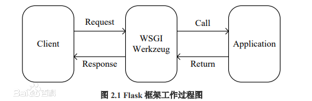
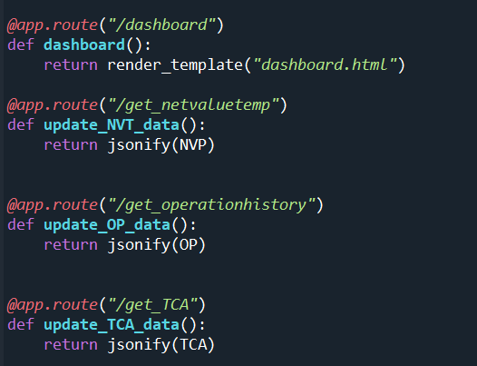
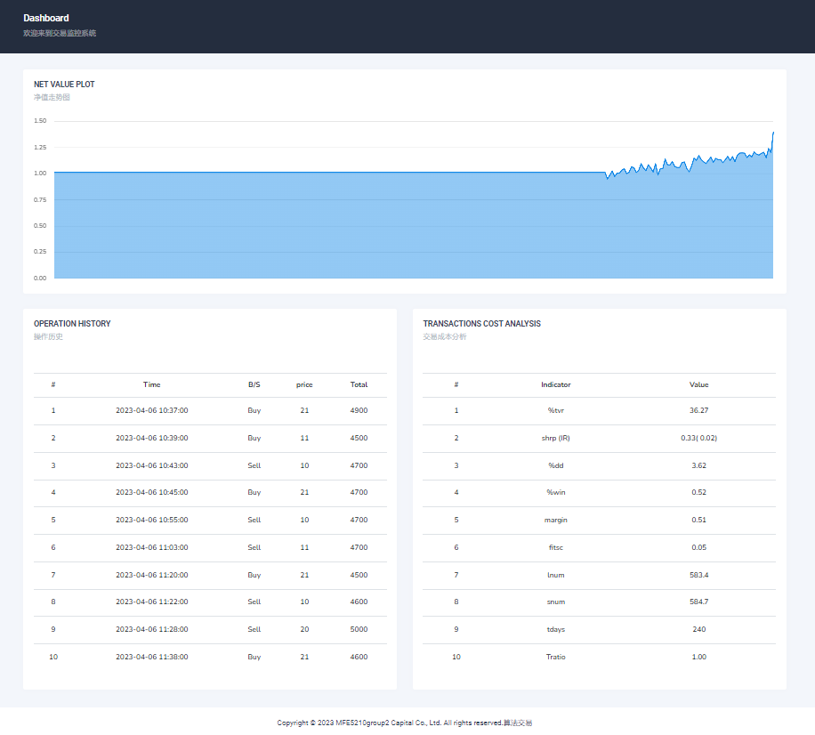

# web端实时监控交易  

### for presentation  
本web端交易实时监控UI是基于flask框架的。Flask是一个轻量级的可定制框架，使用Python语言编写，较其他同类型框架更为灵活、轻便、安全且容易上手。Flask的基本模式为在程序里将一个视图函数分配给一个URL，每当用户访问这个URL时，系统就会执行给该URL分配好的视图函数，获取函数的返回值并将其显示到浏览器上，其工作过程见图。  
  
  
响应前端request后端主要函数有：  
  

该web端主要显示实时交易数据，刷新速率为每秒一次。具体实现方式为：  
banckend.py（后端程序）每秒读取本地文件获取相关交易数据;  
前端静态文件中，static/js/dashboard.init.js以及static/js/flot.init.js文件中设置网页会每秒向后端发送get请求以更新展示数据  

实际用户界面：  
  

##### 以后的改进  
可以在后端连接数据库，展示更多历史完整数据  
开发更多的页面，实现历史数据查询功能  
将数据请求模式改为post，增加账户登录功能，实现不同交易账户的管理    

---------------------------------  

### 功能：
显示最近300S（交易时间）的净值走势：Net Value Plot  
展示最近10条交易操作，每秒刷新： Operation History  
展示最近的交易成本分析指标，每秒更新：Transaction Analysis  

### 部署
保持文件相对路径，主要是三大部分:backend.py+templates(网页)+static(静态文件)  
三种需要展示的数据 以需要的更新频率 写入到相应log文件里，格式与sample保持一致  
在本地运行UI_backend.py  
使用浏览器访问http://本地IP地址:1122/dashboard 即可  (请使用无痕模式！！！)  
如需查看动态效果，可运行UI_backend_randomdata.py

=======  
如果运行backend.py时出现报错：Error: [WinError 10013] 以一种访问权限不允许的方式做了一个访问套接字的尝试  
通过打开cmd 运行命令netstat -ano|findstr 1122 解决  

-----------------------------
### running error (IF)
see https://github.com/sqreen/PyMiniRacer/issues/143 for “The required file "libmini_racer.dylib" can't be found” error, if your computer chip is m1
